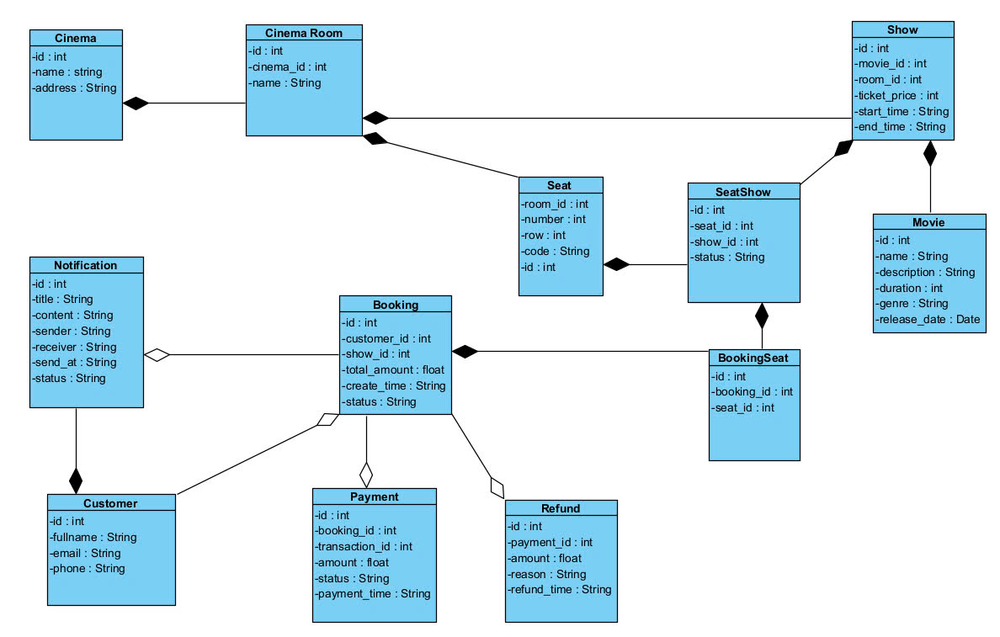

# 📊 Hệ thống đặt vé xem phim - Phân Tích và Thiết Kế

---

## Thành viên

Nhóm 21:

| Họ và tên        | Mã sinh viên |
|------------------|--------------|
| Nguyễn Thế Dũng  | B21DCCN275   |
| Nguyễn Đắc Phong | B21DCCN587   |
| Đàm Công Thoại   | B21DCCN695   |


---


## 1. 🎯  Mô Tả Bài Toán và Mô hình nghiệp vụ

> **Bài toán:** Hệ thống đặt phòng khách sạn trực tuyến

_Mô tả nghiệp vụ_

Hệ thống đặt vé xem phim cho phép khách hàng chọn phim, suất chiếu, ghế ngồi và tiến hành đặt vé trực tuyến.
Sau khi khách hàng chọn phim, hệ thống sẽ kiểm tra tình trạng chỗ ngồi, xác minh thông tin vé, và xử lý thanh toán. 
Nếu đặt vé thành công, hệ thống sẽ gửi thông báo xác nhận vé đã đặt đến email của khách hàng.

---

## 2. 🧩 Xác định các Microservice

_Xác định các thực thể_
**Đối tượng sử dụng**
- Khách hàng cá nhân

**Mục tiêu chính**
- Cho phép khách hàng tìm kiếm và đặt vé trực tuyến
- Tự động hóa quy trình đặt vé và thông báo

**Dữ liệu xử lý**
- Thông tin người dùng
- Thông tin phim, vé, chỗ ngồi và trạng thái chỗ ngồi
- Thông tin thanh toán

_Thiết kế thực thể_




_Thiết kế những dịch vụ_
Ta sẽ đi qua phân tích quy trình nghiệp vụ của dự án này và lọc những logic nghiệp vụ mà sẽ có thể cho vào những thực thể khác nhau để ta có thể đưa ra những đối tượng dịch vụ khả quan của hệ thống.

**Đặt vé xem phim**

1.Bắt đầu quy trình đặt vé: Khách hàng truy cập hệ thống và bắt đầu quy trình đặt vé xem phim.

2.Chọn phim và suất chiếu: Khách hàng chọn phim muốn xem, cùng với suất chiếu và rạp phim cụ thể.

3.Chọn ghế ngồi: Khách hàng chọn ghế ngồi từ danh sách các ghế còn trống.

4.Xác minh ghế ngồi còn trống: Hệ thống kiểm tra tình trạng ghế ngồi đã được chọn xem còn trống hay đã có người đặt.

5.Nếu không còn ghế ngồi, kết thúc quy trình: Nếu ghế đã được đặt bởi người khác, hệ thống thông báo và dừng quy trình.

6.Nhập thông tin khách hàng: Khách hàng cung cấp các thông tin cá nhân như họ tên, số điện thoại và email.

7.Xác minh thông tin vé: Hệ thống xác minh thông tin vé xem phim và các chi tiết liên quan.

8.Nhập và thực hiện thanh toán: Khách hàng tiến hành thanh toán trực tuyến thông qua các cổng thanh toán.

9.Nếu thanh toán thành công, gửi thông báo xác nhận: Nếu giao dịch thành công, hệ thống gửi thông báo xác nhận vé đã đặt đến email của khách hàng.

10.Cập nhật tình trạng ghế ngồi: Hệ thống cập nhật tình trạng ghế đã được đặt vào cơ sở dữ liệu.

11.Lưu thông tin vé và khách hàng vào cơ sở dữ liệu: Hệ thống lưu thông tin vé đã đặt và thông tin khách hàng vào cơ sở dữ liệu để quản lý


| Tên dịch vụ                   | Trách nhiệm                        | Công nghệ   | CSDL    | Giao thức |
|-------------------------------|------------------------------------|-------------|---------|-----------|
| **customer-service**          | Quản lý người dùng                 | RESTFUL API | MySQL   | REST      |
| **movie-service**             | Quản lý phim, suất chiếu, chỗ ngồi | RESTFUL API | MySQL   | REST      |
| **ticket-booking-service**    | Xử lý đặt vé                       | RESTFUL API | MySQL   | REST      |
| **seat-availability-service** | Kiểm tra tình trạng ghế            | RESTFUL API | MySQL   | REST      |
| **notification-service**      | Gửi email thông báo                | RESTFUL API | MySQL   | REST      |
| **payment-service**           | Xử lý thanh toán                   | RESTFUL API | MySQL   | REST      |


## 3. 🔄 Giao tiếp giữa các dịch vụ

### **Cơ chế chính**


### **Chi tiết các kênh kết nối**
| **Kết nối**                 | **Protocol** | **Mục đích**                  |  
|-----------------------------|--------------|-------------------------------|  
| Client ↔ API Gateway        | HTTP/REST    | Tất cả request từ client      |  
| API Gateway ↔ Core Services | HTTP/REST    | Định tuyến request            |  
| Booking ↔ Seat Availability | HTTP/REST    | Kiểm tra ghế trống            |  
| Booking ↔ Notification      | RabbitMQ     | Gửi thông báo không đồng bộ   |  
| Booking ↔ Booking History   | HTTP/REST    | Ghi log đồng bộ               |  


---

## 4. 🗂️ Thiết kế dữ liệu chính


---

## 5. 🛠️ Triển khai service

### **Cấu trúc thư mục**
```
services/
├── user-service/
│ ├── app/
│ │ ├── core/ # Chứa các file cài đặt
│ │ ├── api/ # Xử lý route
│ │ ├── models.py # Mô hình SQLAlchemy
│ │ ├── schemas.py # Mô hình Pydantic
│ │ └── main.py # Ứng dụng FastAPI 
│ ├── migrations/ # Alembic migrations
│ └── Dockerfile
├── booking-history-service/
├── hotel-service/
├── notification-service/
├── room-availability-service/
├── booking-service/
gateway/
├── nginx.conf # Reverse proxy rules
└── Dockerfile
deploy/
├── docker-compose.yml # Multi-container setup
└── .env # Environment variables
```

### **Cơ sở dữ liệu của từng dịch vụ**
| Service                     | Database |
|-----------------------------|----------|
| `customer service`          | MySQL    |  
| `movie service`             | MySQL    |
| `ticket booking service`    | MySQL    | 
| `seat availability service` | MySQL    | 
| `payment service`           | MySQL    | 
| `notification service`      | MySQL    |


---

## 6. 📦 Deployment với Docker

### **Quy trình triển khai**
1. **Build images**:
   ```bash
   docker-compose build
   ```
2. **Khởi động hệ thống**:
   ```bash
   docker-compose up -d
   ```
3. **Kiểm tra trạng thái**:
   ```bash
   docker-compose ps
   ```
4. **(Optional) Scale service**:
   ```bash
   docker-compose up -d --scale user-service=3
   ```

---


## 7. Ưu điểm kiến trúc

**Ưu điểm:**
- **Dễ mở rộng**: Scale riêng từng service (vd: Notification Service khi có khuyến mãi)
- **Độ tin cậy**: Lỗi 1 service không ảnh hưởng toàn hệ thống
- **Bảo trì dễ**: Chuẩn hóa trên FastAPI, database tách biệt

**Nhược điểm:**
- **Phức tạp vận hành**: Quản lý nhiều DB (PostgreSQL, Redis, MongoDB, RabbitMQ)
- **Khó đồng bộ**: Giao dịch xuyên service cần Saga Pattern
- **Giám sát phức tạp**: Cần tool theo dõi request qua nhiều service
- **Chi phí network**: Giao tiếp liên service tăng overhead

**Phù hợp khi:**
- Cần scale theo từng tính năng
- Team có kinh nghiệm DevOps
- Ưu tiên khả năng chịu tải cao
